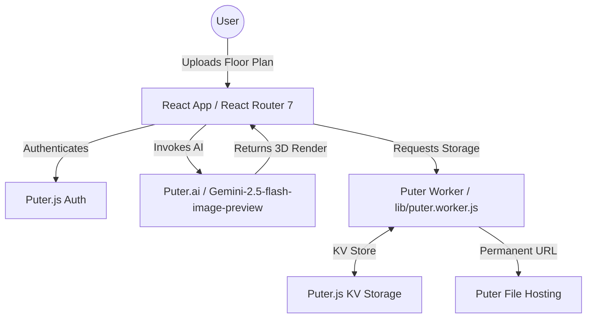

# Room AI Interior Design

Room AI Interior Design is an AI-powered architectural visualization application that transforms 2D floor plans into photorealistic 3D renders.

## 🏗️ Architecture



## 🤸 Quick Start

Follow these 3 simple steps to get the project running locally:

### 1. Clone the Repository

```bash
git clone https://github.com/lwshakib/room-ai-interior-design.git
cd room-ai-interior-design
```

### 2. Set Up Environment Variables

Create a `.env` file in the root directory and add your Puter Worker URL:

```env
VITE_PUTER_WORKER_URL="your_puter_worker_url"
```

### 3. Install and Run

We recommend using [Bun](https://bun.sh/) for the best experience:

```bash
bun install
bun run dev
```

Open [http://localhost:5173](http://localhost:5173) to view the app.

---

For more detailed information on how to contribute, please see [CONTRIBUTING.md](./CONTRIBUTING.md).

Open [http://localhost:5173](http://localhost:5173) in your browser.

---

Built with ❤️ for architects and designers.
